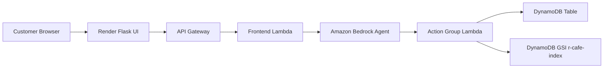

# R-Cafe Visit Planner Agent

R-Cafe Visit Planner Agent is an Amazon Bedrock Agents prototype for managing restaurant table reservations through a web UI, API Gateway, Lambda, and DynamoDB.

The current live scope is table reservation support. Future scope includes menu RAG from S3, local visit planning, weather-aware suggestions, clothing guidance, and richer trip planning around R-Cafe.

## Current Status

The prototype currently supports:

- Create table reservations.
- Retrieve bookings by Booking ID/date/time.
- Find bookings by customer name.
- Fuzzy/closest-name lookup for spelling mistakes and partial names.
- Update booking time, date, party size, name, and special requests.
- Cancel/delete active bookings.
- Preserve special requests such as kids, elderly guests, ramp access, high chair, parking assistance, and accessibility needs.
- Escalate parties greater than 12 guests.
- Handle late-arrival requests with a customer-retention policy.
- Use current date/time from session context so relative dates like `tomorrow` work.

Branding is intentionally not finalized yet. Functionality is the priority.

## Repository Layout

```text
.
├── README.md
├── R_CAFE_PROJECT_HANDOVER.md
├── R_CAFE_LAYER_RESPONSIBILITIES.md
├── Action_group_funtions.md
├── features_in_lambda.md
├── systme-prompt.md
├── lambda/
│   ├── bedrock_agent_lambda.py
│   └── requirements.txt
├── frontend_lambda/
│   ├── lambda_function.py
│   ├── README.md
│   └── requirements.txt
└── ui/
    ├── app.py
    ├── requirements.txt
    └── templates/
```

Notes:

- `systme-prompt.md` is the active Bedrock Agent prompt file. The filename is misspelled in the repo, but it is the current prompt file.
- `Action_group_funtions.md` is the active action-group reference. The filename is misspelled in the repo, but it is the current reference document.
- `R_CAFE_PROJECT_HANDOVER.md` is the best starting point for a new development session.

## Architecture



## Layer Responsibilities

### UI Layer

Folder: `ui/`

Responsibilities:

- Renders the chat app.
- Creates and keeps session ID.
- Sends user query to Flask `/chat`.
- Passes session context to the frontend Lambda through Flask.
- Tracks active booking anchors after successful responses.
- Handles customer-facing error messages.

Important environment variable:

```bash
API_GATEWAY_URL=https://jjedtbichf.execute-api.us-east-1.amazonaws.com/default/R-cafe-lambda-frontend
```

### Frontend Lambda Layer

Folder: `frontend_lambda/`

Responsibilities:

- Receives request from API Gateway.
- Invokes Bedrock Agent Runtime.
- Forwards `sessionState`.
- Injects trusted server-side current date/time.
- Adds context attributes such as timezone, locale, channel, manager contact, and active booking anchors.
- Returns Bedrock response to the UI.

This Lambda is required because the browser/UI should not directly invoke Bedrock Agent Runtime.

### Bedrock Agent Prompt Layer

File: `systme-prompt.md`

Responsibilities:

- Customer-facing behavior.
- Slot filling.
- Date/time interpretation instructions.
- Special request rules.
- Close-match confirmation behavior.
- Large-party and late-arrival policy.

AWS Agent Instructions limit is 20,000 characters. The current prompt is about 13k characters and fits.

### Backend Action-Group Lambda Layer

Folder: `lambda/`

Main file: `lambda/bedrock_agent_lambda.py`

Responsibilities:

- Final deterministic validation.
- Normalize dates and times.
- Enforce one-month booking window.
- Enforce operating hours.
- Enforce party-size rules.
- Validate customer names.
- Reject placeholder/internal planner text.
- Read/write/update/delete DynamoDB bookings.
- Perform exact and fuzzy name lookup.

### DynamoDB Layer

Table: `Restro-Table_booking-R-Cafe`

Main key:

- Partition key: `Booking_ID`
- Sort key: `Booking_DateTime`

GSI:

- Name: `r-cafe-index`
- Partition key: `customer_name`
- Sort key: `Booking_DateTime`

Important attributes:

- `Booking_ID`
- `Booking_DateTime`
- `customer_name`
- `party_size`
- `booking_status`
- `special_requests`

Booking statuses:

- `active`
- `closed-executed`
- `invalid`

## AWS Resources

Current values used during testing:

```text
AWS Region: us-east-1
Bedrock Agent ID: YZTK3R4TM6
Bedrock Agent Alias ID: TSTALIASID
Manager call/WhatsApp: 9916437369
Render URL: https://genai-agent-ai-aws-bedrock-ui.onrender.com
```

## Action Group Functions

See `Action_group_funtions.md` for AWS copy/paste JSON.

### createbooking

Creates a new active booking.

Parameters:

- `customer_name`
- `party_size`
- `booking_date`
- `booking_time`
- `specialRequests`

### getBooking

Retrieves an active booking by exact key details.

Parameters:

- `bookingId`
- `bookingDate`
- `bookingTime`

### updateBooking

Updates an active booking using the compact 5-parameter schema required by AWS.

Parameters:

- `bookingId`
- `bookingDate`
- `bookingTime`
- `updateType`
- `newValue`

Allowed `updateType` values:

- `time`
- `date`
- `partySize`
- `name`
- `specialRequests`

### deleteBooking

Deletes/cancels an active booking.

Parameters:

- `bookingId`
- `bookingDate`
- `bookingTime`

### findBookingByName

Finds active bookings by customer name.

Parameters:

- `customerName`

Behavior:

- Exact/case-variant lookup first using `r-cafe-index`.
- If exact lookup fails, closest-name fallback scans active valid bookings.
- Close matches are suggestions only and require customer confirmation.

## Business Rules

### Booking Window

Reservations are accepted only within one month from the current date.

The current date must come from session attributes or frontend Lambda context. Do not hardcode it into the prompt.

### Default Year

For this project/testing cycle, no-year dates default to `2026`.

Do not silently roll a booking date to `2027`.

### Operating Hours

Normal reservation hours:

```text
11:00 to 23:00
```

Normal bookings cannot be created or updated outside this range.

### Late Arrival Policy

Customer retention rule:

- Keep official booking time within normal hours.
- If customer may arrive after `23:00` but by `23:20`, R-Cafe can try to hold the table as a courtesy.
- Service after `23:00` may be limited.
- Do not promise full menu or full staff after `23:00`.
- Add the late-arrival note to `special_requests`.
- If arrival may be after `23:20`, manager approval is required.
- Manager call/WhatsApp: `9916437369`.
- If the customer is driving, tell them not to call while driving.

### Party Size

- `1` to `12`: standard automatic booking.
- Greater than `12`: manager approval required.

### Phone Numbers

Indian callback numbers should be 10 digits.

If a number has fewer or more than 10 digits, ask for a valid 10-digit Indian mobile number and explain the issue.

### Names

Standard bookings require first and last name.

Reject placeholders and low-quality names:

- `User`
- `Customer`
- `Guest`
- `John Doe`
- `Jane Doe`
- `Test`
- `Unknown`
- one-word names
- repeated junk text

## Name Lookup Strategy

The backend owns name matching. The agent should not guess.

Lookup order:

1. Exact GSI query using `customer_name`.
2. Case/spacing variants.
3. Closest-name fallback over active valid bookings.

Closest matching uses:

- lowercase normalization
- punctuation removal
- extra-space cleanup
- first-name match
- last-name match
- full-name fuzzy similarity
- minimum threshold: `50%`
- top 3 suggestions

Close matches return `CLOSE_MATCH_CONFIRMATION_REQUIRED` and must be confirmed by the customer before update/delete/review.

Example response:

```text
No exact active booking was found for the name "arigala". However, a close match was found: ID: R-0B4F8E on 2026-06-23 at 21:00 for Rajesh Arigala with a party size of 12 and special requests for 2 elders and 3 infants. Is this your booking?
```

## Required IAM Policy

The backend action-group Lambda execution role needs DynamoDB read/write/query/scan permissions.

```json
{
  "Version": "2012-10-17",
  "Statement": [
    {
      "Effect": "Allow",
      "Action": [
        "dynamodb:PutItem",
        "dynamodb:DeleteItem",
        "dynamodb:GetItem",
        "dynamodb:Query",
        "dynamodb:UpdateItem",
        "dynamodb:Scan"
      ],
      "Resource": [
        "arn:aws:dynamodb:us-east-1:825187895465:table/Restro-Table_booking-R-Cafe",
        "arn:aws:dynamodb:us-east-1:825187895465:table/Restro-Table_booking-R-Cafe/index/r-cafe-index"
      ]
    }
  ]
}
```

Why `Scan` is needed:

- Exact lookup uses GSI `Query`.
- Fuzzy lookup cannot query arbitrary similar partition keys.
- The Lambda scans active valid bookings, scores names, and returns close suggestions.

## Local Development

### Run the UI Locally

From the project root:

```bash
cd "/Users/jhonny001/Desktop/GenAi Notes/Final_GenAi/Ai Agents/AWS/GenAi_Agent_Ai_AWS_Bedrock_ui/ui"
python3 -m venv .venv
source .venv/bin/activate
pip install -r requirements.txt
export PORT=8090
export API_GATEWAY_URL="https://jjedtbichf.execute-api.us-east-1.amazonaws.com/default/R-cafe-lambda-frontend"
python app.py
```

Open:

```text
http://localhost:8090
```

### Render Setup

Render service type:

```text
Web Service
```

Root directory:

```text
ui
```

Build command:

```bash
pip install -r requirements.txt
```

Start command:

```bash
python app.py
```

Environment variables:

```text
API_GATEWAY_URL=https://jjedtbichf.execute-api.us-east-1.amazonaws.com/default/R-cafe-lambda-frontend
BEDROCK_AGENT_ID=YZTK3R4TM6
BEDROCK_AGENT_ALIAS_ID=TSTALIASID
PORT=8090
```

Render may provide its own `PORT`. The app uses `PORT` from the environment and defaults to `8090` locally.

## AWS Deployment Order

Use this order when updating AWS:

1. Update backend action-group Lambda with `lambda/bedrock_agent_lambda.py`.
2. Confirm Lambda execution role includes `dynamodb:Scan`.
3. Update frontend Lambda only if `frontend_lambda/lambda_function.py` changed.
4. Update Bedrock Agent instructions from `systme-prompt.md`.
5. Ensure Bedrock action-group descriptions match `Action_group_funtions.md`.
6. Save the Bedrock Agent.
7. Prepare the Bedrock Agent.
8. Test in Bedrock console.
9. Test through Render UI.

## AWS CLI Helpers

Check current AWS identity:

```bash
aws sts get-caller-identity
```

List DynamoDB tables:

```bash
aws dynamodb list-tables --region us-east-1
```

Describe the booking table:

```bash
aws dynamodb describe-table \
  --table-name Restro-Table_booking-R-Cafe \
  --region us-east-1
```

Query exact customer name through the GSI:

```bash
aws dynamodb query \
  --table-name Restro-Table_booking-R-Cafe \
  --index-name r-cafe-index \
  --key-condition-expression "customer_name = :name" \
  --expression-attribute-values '{":name":{"S":"rajesh arigala"}}' \
  --region us-east-1
```

Download S3 DynamoDB export folder:

```bash
aws s3 sync s3://restro-menu-1/AWSDynamoDB/ ./dynamodb-export
```

## Validation Commands

Syntax-check backend Lambda without writing `__pycache__`:

```bash
python3 - <<'PY'
from pathlib import Path
path = Path('lambda/bedrock_agent_lambda.py')
source = path.read_text(encoding='utf-8')
compile(source, str(path), 'exec')
print('syntax ok')
PY
```

Check prompt size:

```bash
wc -c systme-prompt.md
```

It must stay under the AWS Bedrock Agent instruction limit of 20,000 characters.

Search for close-match rules:

```bash
rg "CLOSE_MATCH|closest|dynamodb:Scan|specialRequests|23:20" .
```

## Recommended Test Cases

### Happy Path Create

```text
Book a table for 4 people tomorrow at 7 PM.
```

Expected:

- Agent asks for first and last name if missing.
- Agent asks special requests once.
- Booking succeeds with real `R-` Booking ID.

### Update Active Booking

```text
I want to update my booking.
Change the time to 9pm.
```

Expected:

- Uses active booking context.
- Does not ask for Booking ID again if same-session anchor exists.

### Name Correction

```text
Can I change my name? There is a spelling mistake.
Rajesh Arigala
```

Expected:

- Updates same Booking ID.
- Does not create a new booking.

### Special Requests

```text
I have a kid and 2 grandparents.
I need parking assistance.
I need a ramp.
```

Expected:

- Special requests are accumulated and preserved.

### Large Party

```text
Book for 13 people today at 10pm.
```

Expected:

- No Booking ID.
- Manager approval message.
- Manager number shown when useful.

### Close Name Match

If DB contains `Rajesh Arigala`, test:

```text
Find my booking under arigala.
```

Expected:

- No exact active booking found.
- Close match suggested.
- Customer confirmation requested.

### Late Arrival

```text
I am running late and will arrive by 11:15pm.
```

Expected:

- Keep current booking active.
- Add late-arrival special request.
- Say service may be limited after 23:00.
- No official booking time past 23:00.

For after 23:20:

```text
I will reach by 11:30pm.
```

Expected:

- Manager approval required.
- Provide `9916437369`.

## Known Caveats

- Fuzzy lookup uses `Scan`, which is acceptable for demo scale but not ideal for production.
- Production identity should use phone/email/login instead of name matching.
- UI still needs customer-facing cleanup before a real launch.
- Branding is not final.
- Future menu/weather/local-visit tools are not connected yet.
- Nova Pro behaved better than Nova Lite for avoiding tool syntax leakage.

## Next Steps

Short-term:

1. Continue testing exact and fuzzy lookup flows.
2. Polish minor prompt wording such as replacing "the user" with "you".
3. Improve UI customer-facing layout by hiding technical settings.
4. Keep prompt under 20,000 characters.

Medium-term:

1. Add normalized customer-name fields to DynamoDB for better lookup.
2. Add login/signup architecture using phone/email/Google.
3. Add OTP or email acknowledgement.
4. Add account-level booking ownership.
5. Add proper manager ticket flow.

Future:

1. Add S3 menu RAG.
2. Add local places/search tool.
3. Add weather and clothing guidance.
4. Move toward multi-agent architecture.
5. Finalize branding for the one-day R-Cafe visit planner experience.

## Handover

For a complete development handover, read:

```text
R_CAFE_PROJECT_HANDOVER.md
```

That document summarizes the full session, including bugs discovered, fixes applied, AWS update order, and remaining decisions.
